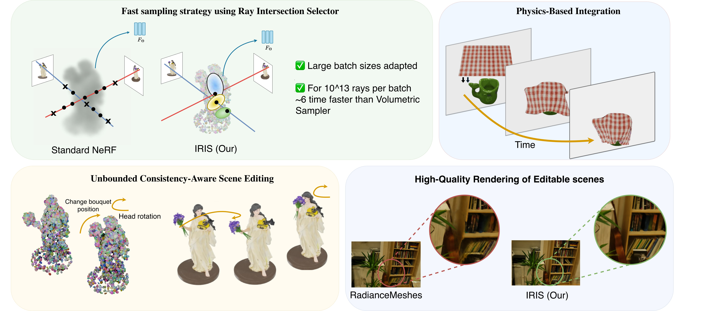

# IRIS: Intersection-aware Ray-based Implicit Editable Scenes


<p align="center">
  <a href="https://arxiv.org/abs/2508.02831"></a>
  <a href="https://mikolajzielinski.github.io/iris.github.io/"></a>
</p>


<p align="center">
  
</p>

<p align="center">
  
  
  
</p>

# ⚙️ Installation

This project is developed as an extension for Nerfstudio. To get started, please install [Nerfstudio](https://github.com/nerfstudio-project/nerfstudio/tree/2adcc380c6c846fe032b1fe55ad2c960e170a215) along with its dependencies. <br>

<p align="center">
    <!-- pypi-strip -->
    <picture>
    <source media="(prefers-color-scheme: dark)" srcset="https://docs.nerf.studio/_images/logo-dark.png">
    <source media="(prefers-color-scheme: light)" srcset="https://docs.nerf.studio/_images/logo.png">
    <!-- /pypi-strip -->
    
    <!-- pypi-strip -->
    </picture>
    <!-- /pypi-strip -->
</p>

Then, install this repo with:

```bash
pip install -e .
ns-install-cli
```

🚀 This will install the package in editable mode and kick off the Nerfstudio CLI installer to get you all set up and ready to go! 🎉

> Note: If for some reason the method is not working right away for you it may mean tat you have to compile the OptiX code for your specific machine. In order to do so please refer to this [instruction](docs/installation.md).

# Running the demo
To test if everything was installed properly, you can run the `lego` demo.

```bash
# First train the model with (remember to have sparse_pc.ply, instruction written below)
ns-train iris --data data/lego --timestamp demo

# Export triangle soup
iris-export tetrahedrons --load-config outputs/lego/iris/demo/config.yml

# Prepare the animation with blender
blender -b blender/lego/Lego_demo.blend -P blender/lego/script.py

# Now you can render the animation
iris-render dataset --load-config outputs/lego/iris/demo/config.yml --rendered-output-names rgb --output-path edits/lego_demo --selected-camera-idx 50

# Render the video
cd edits/lego_demo
ffmpeg -framerate 24 -i %05d.jpg -c:v libx264 -pix_fmt yuv420p lego_demo.mp4
```

# Data preparation
### Synthetic data
By default, our method supports the NeRF Synthetic format. If you want to use your own data you need to put `sparse_pc.ply` in the dataset folder. For synthetic data you can use point cloud generated with [3DGS](https://github.com/graphdeco-inria/gaussian-splatting).

### Real data
For real data please follow [Nerfstudio data format](https://docs.nerf.studio/quickstart/data_conventions.html). Like with synthetic data, you'll also need to place `sparse_pc.ply` in the dataset folder to initialize the network with a sparse point cloud (once again you can use 3DGS).

# Training the network

Example train commands:
``` bash
# For nerf synthetic
ns-train iris --data <path_to_dataset>

# For MiP-NeRF but also other real data
ns-train iris_real --data <path_to_dataset>
```

# Evaluating model
Example evaluation commands:
```bash
ns-eval \
--load_config <path_to_config_of_the_trained_model> \
--output-path <output_path_for_metrics_json> \
--render-output-path <output_path_for_renders>
```

# Rendering results
We use [Blender](https://www.blender.org) for generating our animations. It is important to generate for each frame of your animation an `*.ply` file containing modified Gaussians obtained from the training. You can find them in the output folder of your training under the name `step-<num_steps>_means.ply`. 

> ⚠️  It is very important to use only `*.ply` files since they don't change the order of vertices upon the save.

In the output folder of your trained model (usually named with the timestamp) create `camera_path` folder and put your `*.ply` file there. It is important to name them `00000.ply`, `00001.ply`, `00002.ply`, etc.

Now you are ready to go and you can start rednering. You have two options right here:
### Dataset Render
``` bash
iris-render dataset \
  --load-config outputs/<path_to_your_config.yml> \
  --output-path edits/<output_folder> \
  --rendered-output-names rgb \
  --selected-camera-idx <num_camera_from_test_data>
```
 - If you specify a camera index, all frames will be rendered from that viewpoint.
 - If not, the tool renders from all test-time cameras.

<!-- ### Camera Path Render
``` bash
iris-render camera-path \
  --load-config outputs/<path_to_your_config.yml> \
  --camera-path-filename <camera_paths_folder> \
  --output-path edits/<output_folder> \
  --output-format images
```
-  The camera path here refers to what’s generated by the Nerfstudio viewer not your `*.ply` animation folder! -->

# Citations
If you found this work usefull, please consider citing:

``` bibtex
```
